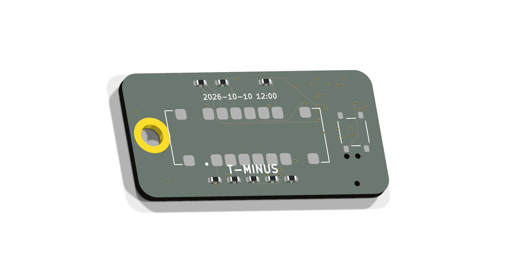

# T-MINUS — keyring countdown to 2026-10-10 12:00

A 44 × 23 mm, 4-layer keyring PCB that counts down the hours to
**10 October 2026, midday** on a red 4-digit 7-segment display. Powered by a
CR2032, it keeps time for years in deep sleep; press the button and the
hours remaining glow for 8 seconds. Under 100 hours to go it switches to
minutes (decimal point lit as the marker). At T-0 it shows `0.0.0.0`.



## How it works

- **STM32L031G6U6** (QFN28) runs the show: RTC on a 32.768 kHz crystal,
  Stop-mode sleep at ~1 µA with full RAM retention.
- **XINGLIGHT XL-SA2401SRWC** 0.2" 4-digit red display, common cathode,
  multiplexed directly from GPIO (segments through 330 Ω on PA0–PA7, digit
  cathodes on PB0/PB1/PA8/PA9). Red Vf ≈ 1.8 V runs straight off the coin
  cell — no boost, no driver IC.
- **Battery life**: ~1 µA sleeping + ~10 mA for 8 s per press. At ten
  presses/day that's ≈ 2 years on one CR2032; the countdown itself survives
  until the cell is truly dead.
- **Programming**: Tag-Connect TC2030-IDC-NL footprint (zero BOM cost). Flash
  with any SWD probe; the RTC is seeded from the firmware build timestamp,
  so `make flash` right after `make` and the clock is correct to seconds.
- Front: display, button, segment resistors. Back: CR2032 holder, MCU,
  crystal, TC2030. Keyring hole (Ø4) at the left end, clear of everything.

## Repo layout

| Path | What |
|---|---|
| `hw/countdown/` | KiCad 10 project (schematic, PCB, DRC/ERC reports) |
| `hw/lib/` | Custom symbols + footprints (display, holder, switch, hole) |
| `hw/scripts/` | The full generation pipeline (see below) |
| `fab/` | **JLCPCB order files: gerbers.zip, bom.csv, cpl.csv** |
| `fw/` | Firmware (bare-metal C, no HAL; `make && make flash`) |
| `docs/renders/` | Verification renders |
| `designlog.md` | Full engineering narrative, decisions and reviews |
| `prompts.md` | Prompt log |

## Reproducing the board from scratch

Everything is generated — schematic, footprints, placement, routing, fab
files — by scripts (KiCad 10 CLI + pcbnew Python + a custom A* router):

```sh
python3 hw/scripts/gen_footprints.py     # custom footprints from datasheet dims
python3 hw/scripts/gen_sch_countdown.py  # schematic + intended netlist
# ERC + netlist verification, then:
./hw/scripts/route_own.sh                # place, fanout power, planes, route, DRC
./hw/scripts/render_views.sh             # eyeball it
# fab outputs:
<kicad-python> hw/scripts/export_fab.py hw/countdown/countdown.kicad_pcb fab/
```

## Ordering (JLCPCB)

See `fab/ORDERING.md` for the click-by-click instructions, including the
one thing you MUST eyeball in their UI: part rotations in the placement
preview (especially U1) before paying.
